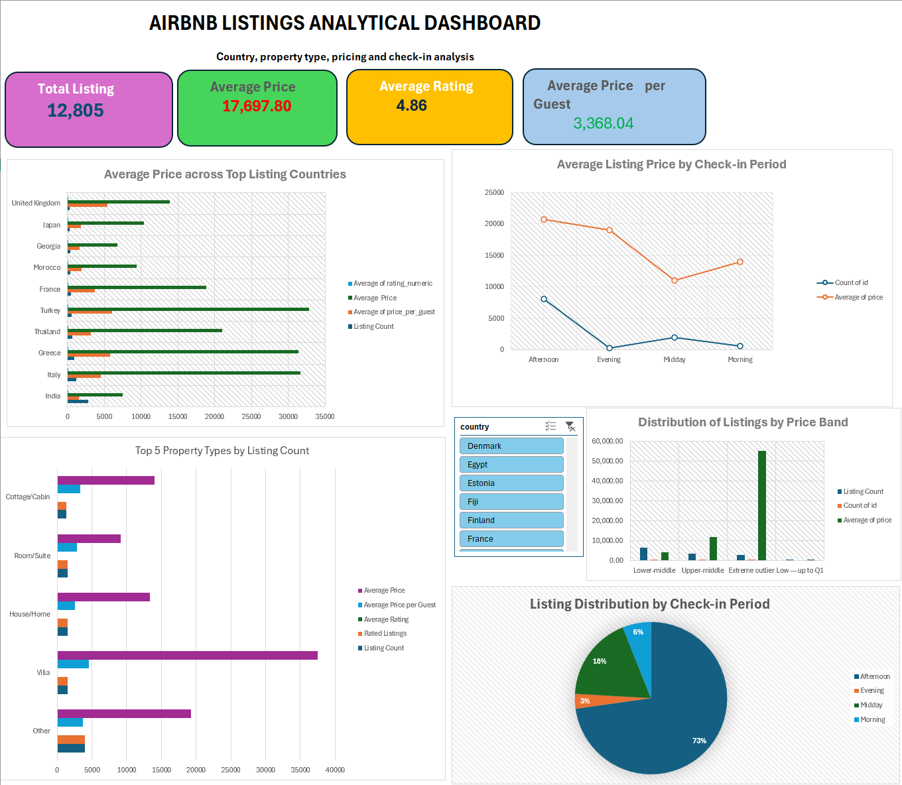
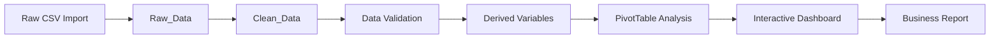

# Airbnb Listings Analysis & Interactive Excel Dashboard

<p align="center">
  <strong>End-to-end Airbnb data analysis in Microsoft Excel</strong><br>
  Data preparation • Validation • Exploratory analysis • PivotTables • PivotCharts • Interactive dashboard
</p>

<p align="center">
  
  
  
  
  
</p>

---

## Table of Contents

- [Project Overview](#project-overview)
- [Business Problem](#business-problem)
- [Project Objectives](#project-objectives)
- [Dashboard Preview](#dashboard-preview)
- [Dataset Overview](#dataset-overview)
- [Analytical Workflow](#analytical-workflow)
- [Data Preparation](#data-preparation)
- [Validation Framework](#validation-framework)
- [Exploratory Analysis](#exploratory-analysis)
- [Dashboard Features](#dashboard-features)
- [Key Findings](#key-findings)
- [Workbook Architecture](#workbook-architecture)
- [Excel Techniques Used](#excel-techniques-used)
- [Limitations](#limitations)
- [How to Use the Project](#how-to-use-the-project)
- [Repository Structure](#repository-structure)
- [Reproducibility Notes](#reproducibility-notes)
- [Future Improvements](#future-improvements)
- [Author](#author)

---

## Project Overview

This project presents a complete analysis of a global Airbnb listings dataset using Microsoft Excel. It demonstrates how spreadsheet tools can be used to clean data, validate records, engineer analytical variables, investigate pricing patterns, and communicate results through an interactive dashboard.

The analysis focuses on variation in listing volume and price across countries, locations, property types, price bands, and check-in periods. It also identifies unusual price behaviour and evaluates the effect of extreme values on summary statistics.

The final solution includes:

- a preserved raw-data layer;
- a cleaned analytical dataset;
- a dedicated validation and audit sheet;
- PivotTable-based exploratory analysis;
- interactive PivotCharts and slicers;
- a concise business report summarising findings and limitations.

---

## Business Problem

Airbnb listing data contains useful information about price, location, property characteristics, guest capacity, ratings, and check-in behaviour. However, the raw dataset includes formatting inconsistencies, mixed data types, missing values, long identifiers, unstandardised locations, and extreme prices.

The project addresses the following business questions:

1. Which countries and locations contain the highest concentration of listings?
2. How do average prices differ across countries and property categories?
3. Which property types are associated with higher or lower prices?
4. How strongly do extreme prices affect the overall average?
5. How are listings distributed across statistical price bands?
6. Do listing patterns differ across check-in periods?
7. How can these findings be communicated through an interactive Excel dashboard?

---

## Project Objectives

- Prepare and validate the Airbnb dataset for analysis.
- Preserve the original data and maintain a clear audit trail.
- Investigate listing concentration across countries and derived locations.
- Compare pricing patterns across property types and price bands.
- Identify and quantify high-price outliers.
- Create an interactive dashboard using PivotTables, PivotCharts, and slicers.
- Translate analytical results into business-oriented insights.
- Document assumptions, calculations, and dataset limitations clearly.

---

## Dashboard Preview

> Add the final dashboard screenshot to `images/airbnb-dashboard.png`.

<p align="center">
  
</p>

### Dashboard components

- **Total Listings**
- **Average Price**
- **Average Rating**
- **Average Price per Guest**
- Average price across selected countries
- Top property types by listing count
- Listing distribution by price band
- Listing or price comparison by check-in period
- Interactive slicers for:
  - Country
  - Property Type
  - Price Band

---

## Dataset Overview

| Item | Result |
|---|---:|
| Total listings | 12,805 |
| Original variables | 23 |
| Countries after cleaning | 119 |
| Numeric-rated listings | 8,567 |
| New or unrated listings | 4,238 |
| Minimum price | 393 |
| First quartile | 3,994 |
| Median price | 8,175 |
| Average price | 17,697.80 |
| Third quartile | 16,062 |
| Maximum price | 1,907,963 |
| High-price outliers | 1,273 |

### Main source variables

The dataset includes:

- listing and host identifiers;
- listing name and address;
- country;
- price;
- rating and review count;
- guest capacity;
- bedrooms, beds, bathrooms, and toilets;
- facilities and house rules;
- check-in and checkout information.

> **Important:** The dataset does not provide a standardised currency field. Price values are therefore presented exactly as supplied and should not be interpreted as directly comparable across all countries.

---

## Analytical Workflow



The workflow separates source data, cleaning, validation, analysis, and reporting. This improves transparency, reduces the risk of accidental data loss, and supports reproducibility.

---

## Data Preparation

The original dataset was retained unchanged in the `Raw_Data` worksheet. Cleaning and transformation were performed in `Clean_Data`.

### Cleaning actions

- Removed unnecessary leading and trailing spaces from country names.
- Stored long listing IDs as text to preserve all digits.
- Corrected inconsistent column names.
- Converted review counts into numeric format.
- Converted numeric ratings while retaining `"New"` as a separate listing status.
- Extracted an approximate location from the address field.
- Retained missing values where records remained useful for analysis.
- Flagged unusual prices rather than deleting them.

### Derived variables

| Variable | Description |
|---|---|
| `country_clean` | Standardised country value |
| `location_clean` | First location component extracted from address |
| `rating_numeric` | Numeric form of rating |
| `rating_status` | Rated or new listing classification |
| `reviews_numeric` | Cleaned numeric review count |
| `price_per_guest` | Price divided by guest capacity |
| `property_type` | Property category inferred from listing-name keywords |
| `price_band` | Statistical price grouping |
| `checkin_period` | Morning, midday, afternoon, evening, flexible, or missing |
| `price_outlier` | Typical or high-price outlier |
| `record_check` | Essential-record validation flag |

### Property-type classification

Property type was not supplied as a dedicated variable. It was therefore derived using keywords in listing names.

Examples:

- `Villa`
- `Apartment/Condo`
- `House/Home`
- `Room/Suite`
- `Cottage/Cabin`
- `Hotel/Guesthouse`
- `Studio/Loft`
- `Farm Stay`
- `Unique Stay`
- `Other`

The `Other` category was retained when the listing name did not provide enough evidence for a reliable classification.

---

## Validation Framework

A dedicated `Data_Checks` worksheet was created to verify data quality, completeness, and calculation accuracy.

### Main validation results

| Validation check | Result |
|---|---:|
| Clean records | 12,805 |
| Duplicate listing IDs | 0 |
| Missing IDs | 0 |
| Missing listing names | 0 |
| Missing cleaned countries | 0 |
| Missing prices | 0 |
| Zero or negative prices | 0 |
| Invalid guest capacity | 0 |
| Missing host names | 8 |
| Missing check-in values | 800 |
| Missing checkout values | 2,450 |

### Excel precision issue identified

Several listing IDs contained more than 15 digits. Excel automatically rounds long numbers stored as numeric values, which initially created 13 false duplicate IDs.

The issue was resolved by importing and storing listing IDs as text.

### Outlier methodology

Price outliers were detected using the interquartile range method:

```text
IQR = Q3 - Q1
Upper Boundary = Q3 + 1.5 × IQR
```

Calculated values:

| Measure | Result |
|---|---:|
| Q1 | 3,994 |
| Q3 | 16,062 |
| IQR | 12,068 |
| Upper boundary | 34,164 |
| High-price outliers | 1,273 |

Outliers were flagged rather than removed because there was insufficient evidence to treat them as incorrect records.

---

## Exploratory Analysis

The analysis was developed using PivotTables and structured Excel formulas.

### Country analysis

Measures included:

- listing count;
- average price;
- average rating;
- rated-listing count;
- average price per guest.

### Property-type analysis

Measures included:

- listing count;
- average price;
- average rating;
- rated-listing count;
- average price per guest.

### Location analysis

The analysis compared listing volume and average price across locations derived from the address field.

### Price-band analysis

Listings were grouped into:

1. Low — up to Q1
2. Lower-middle
3. Upper-middle
4. High
5. Extreme outlier

### Check-in-period analysis

Check-in values were classified into:

- Morning
- Midday
- Afternoon
- Evening
- Flexible
- Missing

This represents a time-of-day comparison, not a historical time series.

---

## Dashboard Features

The dashboard was designed to provide a concise executive view while supporting interactive exploration.

### KPI cards

- Total Listings
- Average Price
- Average Rating
- Average Price per Guest

### Visualisations

- Average price across selected countries
- Top property types by listing count
- Listing distribution across price bands
- Listing or price comparison by check-in period

### Interactive controls

Slicers allow users to filter results by:

- Country
- Property Type
- Price Band

The KPI cards and PivotCharts update dynamically when slicer selections are changed.

---

## Key Findings

### 1. Listing volume does not imply higher price

India had the largest number of listings, with 2,779 records, but its average price was lower than several countries with fewer listings.

This suggests that listing supply and average price are not directly related.

### 2. Villas were associated with higher prices

Among the major derived property categories, villas had the highest average price. Rooms and suites were generally positioned at the lower end of the price range.

### 3. The price distribution was strongly right-skewed

The overall average price of 17,697.80 was substantially higher than the median of 8,175.

This difference was driven by a relatively small group of very expensive listings.

### 4. High-price outliers had a large impact

A total of 1,273 listings were identified as high-price outliers, representing approximately 9.9% of the dataset.

These records had a disproportionate effect on the average price, making the median a more representative measure of a typical listing.

### 5. Afternoon was the dominant check-in period

Afternoon check-in was the most common category and also recorded the highest average price among the principal time periods.

This association should not be interpreted as causal because property type, capacity, and location may also influence price.

---

## Workbook Architecture

| Worksheet | Purpose |
|---|---|
| `Raw_Data` | Preserved source dataset |
| `Clean_Data` | Cleaned data and derived fields |
| `Data_Checks` | Data-quality checks and outlier calculations |
| `Analysis` | PivotTables and analytical summaries |
| `Dashboard` | KPI cards, charts, and slicers |

---

## Excel Techniques Used

### Data preparation

- Excel Tables
- Structured references
- Power Query import
- Text formatting for long identifiers
- Conditional formatting

### Formulas

- `TRIM`
- `LEFT`
- `FIND`
- `SEARCH`
- `VALUE`
- `SUBSTITUTE`
- `IF`
- `IFERROR`
- `IFS`
- `LET`
- `OR`
- `COUNTIF`
- `COUNTBLANK`
- `AVERAGE`
- `MEDIAN`
- `QUARTILE.INC`
- `ROWS`
- `UNIQUE`

### Analysis and visualisation

- PivotTables
- PivotCharts
- Value filters
- Top-N analysis
- Percentage-of-total calculations
- Slicers
- Report connections
- KPI cards linked to PivotTables

---

## Limitations

- The dataset does not include a standardised currency variable.
- International price comparisons may reflect currency differences.
- Property type was inferred from listing-name keywords.
- Many listings were assigned to `Other` because the name did not clearly identify the property type.
- Location was derived from unstandardised address text.
- Spelling variants may separate the same geographical area.
- The dataset does not contain historical booking or availability dates.
- Check-in-period analysis is not a true time-series analysis.
- New listings do not contain numeric ratings.
- Extreme prices may represent luxury properties, different currencies, different units, or data-entry issues.
- The analysis is descriptive and does not establish causal relationships.

---

## How to Use the Project

1. Download the Excel workbook from the `workbook` directory.
2. Open the file in Microsoft Excel.
3. Enable editing if prompted.
4. Open the `Dashboard` worksheet.
5. Use the slicers to filter by:
   - Country
   - Property Type
   - Price Band
6. Use the clear-filter icon on each slicer to reset the dashboard.
7. Review `Data_Checks` for validation results.
8. Review `Analysis` for the underlying PivotTables.

> Microsoft Excel desktop is recommended because slicer behaviour may vary in browser-based spreadsheet viewers.

---

## Repository Structure

```text
airbnb-listings-excel-dashboard/
│
├── README.md
├── workbook/
│   └── airbnb_analysis_dashboard.xlsx
│
├── report/
│   └── airbnb_business_report.pdf
│
├── images/
│   └── airbnb-dashboard.png
│
├── data/
│   └── README.md
│
├── LICENSE
└── .gitignore
```

### Data directory note

The original dataset may be excluded from the public repository where redistribution rights are unclear. Add a short `data/README.md` explaining the expected file name and source restrictions.

---

## Reproducibility Notes

To reproduce the project:

1. Import the original CSV using **Data → From Text/CSV**.
2. Set listing IDs to **Text** during import.
3. Preserve the original import in `Raw_Data`.
4. Create the cleaned and derived variables in `Clean_Data`.
5. Rebuild validation checks in `Data_Checks`.
6. Create PivotTables from the same cleaned Excel Table.
7. Connect all slicers to the dashboard PivotTables.
8. Clear all slicer selections before saving the final workbook.

### Recommended quality checks

- Confirm record count equals 12,805.
- Confirm duplicate listing IDs equal 0.
- Confirm no required price or country values are missing.
- Confirm price-outlier count equals 1,273.
- Confirm dashboard KPIs update when slicers are used.
- Confirm no `#DIV/0!`, `#VALUE!`, or broken references remain.

---

## Future Improvements

- Standardise all prices to a single currency.
- Use an official property-type field rather than keyword classification.
- Geocode addresses and standardise locations.
- Add historical booking and availability data.
- Compare median prices as well as average prices.
- Introduce occupancy, revenue, and seasonality metrics.
- Develop a Power BI or Tableau version of the dashboard.
- Automate the cleaning process using Power Query.
- Add statistical modelling to estimate the main drivers of price.

---

## Academic and Data-Use Note

This repository is intended as a portfolio demonstration of spreadsheet-based data analysis and dashboard development.

Before publishing assessed work:

- remove university login IDs and personal information;
- confirm that public sharing is permitted;
- avoid uploading restricted coursework materials;
- avoid redistributing the source dataset where licensing is unclear.

---

## Author

**[Your Name]**  
MSc Data Science  
University of Leicester

### Skills demonstrated

`Microsoft Excel` · `Data Cleaning` · `Data Validation` · `Exploratory Data Analysis` · `PivotTables` · `PivotCharts` · `Slicers` · `Dashboard Design` · `Business Reporting`

---

## Suggested Repository Metadata

**Repository name**

```text
airbnb-listings-excel-dashboard
```

**Description**

```text
End-to-end Airbnb listings analysis in Microsoft Excel, featuring data cleaning, validation, PivotTables, outlier analysis, an interactive dashboard, and a business report.
```

**Topics**

```text
excel
airbnb
data-analysis
data-cleaning
dashboard
pivot-tables
pivot-charts
data-visualization
business-intelligence
exploratory-data-analysis
spreadsheet
```

**Suggested first commit**

```text
Initial release: add Airbnb analysis workbook, interactive dashboard and business report
```
